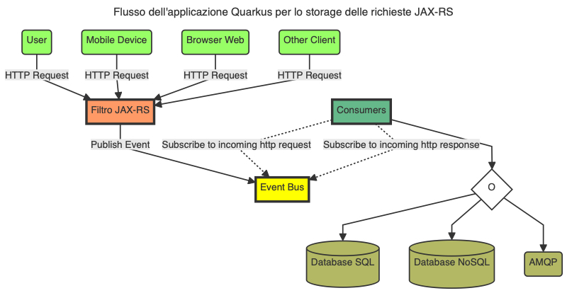

# Quarkus Event Bus Logging Filter JAX-RS

[](https://github.com/fugerit-org/fj-daogen/blob/main/CHANGELOG.md)
[](https://opensource.org/licenses/MIT)
[](https://github.com/fugerit-org/fj-universe/blob/main/CODE_OF_CONDUCT.md)


Questo progetto è un'applicazione Quarkus che mostra come realizzare un sistema che sia capace di
tracciare le richieste JAX-RS in arrivo e in uscita dall'applicazione su diversi canali di
storage, come ad esempio un database MongoDB, SQL o un broker AMQP sfruttando l'Event Bus 
di Quarkus.

[](src/doc/resources/images/flusso_applicazione_quarkus.jpeg)

**Figura 1**: Flusso dell'applicazione Quarkus

Se vuoi saperne di più su Quarkus, visita il sito ufficiale [quarkus.io](https://quarkus.io/).
A seguire trovi le istruzioni per eseguire l'applicazione in modalità sviluppo e creare un eseguibile
nativo.

## Requisiti
La tabella seguente elenca i requisiti necessari per l'implementazione ed esecuzione del progetto 
Quarkus.

| Nome                     | Opzionale | Descrizione                                                  |
| ------------------------ | --------- | ------------------------------------------------------------ |
| Java JDK 17/21           | NO        | Implementazione di OpenJDK 17/21. È possibile usare qualunque delle [implementazioni disponibili](https://en.wikipedia.org/wiki/OpenJDK). Per questo articolo è stata usata la versione 21 di OpenJDK e l'implementazione di Amazon Corretto 21.0.2. |
| Git                      | NO        | Tool di versioning.                                          |
| Maven 3.9.6              | NO        | Tool di build per i progetti Java e di conseguenza Quarkus.  |
| Quarkus 3.9.2            | NO        | Framework Quarkus 3.9.2 la cui release note è disponibile qui https://quarkus.io/blog/quarkus-3-9-2-released/. Per maggiori informazioni per le release LTS fare riferimento all'articolo [Long-Term Support (LTS) for Quarkus](https://quarkus.io/blog/lts-releases/). |
| Quarkus CLI              | SI        | Tool a linea di comando che consente di creare progetti, gestire estensioni ed eseguire attività essenziali di creazione e sviluppo. Per ulteriori informazioni su come installare e utilizzare la CLI (Command Line Interface) di Quarkus, consulta la [guida della CLI di Quarkus](https://quarkus.io/guides/cli-tooling). |
| Docker v26 o Podman v4/5 | NO        | Tool per la gestione delle immagini e l'esecuzione dell'applicazione in modalità container. La gestione delle immagini/container sarà necessaria nel momento in cui saranno sviluppati gli Event Handler che dovranno comunicare con i servizi esterni all'applicazione (vedi NoSQL, SQL, AMQP). La gestione delle immagini necessarie e container, sarà totalmente trasparente per noi sviluppatori in quanto a carico dei [Dev Services di Quarkus](https://quarkus.io/guides/dev-services). |
| GraalVM                  | SI        | Per la build dell'applicazione in modalità nativa. Per maggiori informazioni fare riferimento alla documentazione [Building a Native Executable](https://quarkus.io/guides/building-native-image). |
| Ambiente di sviluppo C   | SI        | Richiesto da GraalVM per la build dell'applicazione nativa. Per maggiori informazioni fare riferimento alla documentazione [Building a Native Executable](https://quarkus.io/guides/building-native-image). |
| cURL 7.x/8.x             | SI        | Tool per il test dei Resource Endpoint (servizi REST)        |

**Tabella 1** - Requisiti (anche opzionali) necessari per l'implementazione del progetto Quarkus

Le estensioni Quarkus utilizzate per l'implementazione del progetto sono le seguenti:
- io.quarkus:quarkus-hibernate-validator ✔
- io.quarkus:quarkus-mongodb-client ✔
- io.quarkus:quarkus-openshift ✔
- io.quarkus:quarkus-smallrye-health ✔
- io.quarkus:quarkus-vertx ✔
- io.quarkus:quarkus-messaging-amqp ✔
- io.quarkus:quarkus-arc ✔
- io.quarkus:quarkus-rest ✔
- io.quarkus:quarkus-rest-jackson ✔

## Esecuzione dell'applicazione in dev mode

Puoi eseguire l'applicazione in modalità sviluppo che abilita il live coding utilizzando:
```shell script
./mvnw compile quarkus:dev
```

> **_NOTE:_**  Quarkus ora include una UI di sviluppo, disponibile solo in modalità sviluppo all'indirizzo http://localhost:8080/q/dev/.

## Packaging e avvio dell'applicazione

L'applicazione può essere impacchettata utilizzando:
```shell script
./mvnw package
```

Il processo produrrà il file `quarkus-run.jar` in `target/quarkus-app/`.
Questo non è un _über-jar_ in quanto le dipendenze sono copiate nella 
directory `target/quarkus-app/lib/`.

L'applicazione è ora eseguibile utilizzando `java -jar target/quarkus-app/quarkus-run.jar`.

Se vuoi creare un _über-jar_, esegui il seguente comando:
```shell script
./mvnw package -Dquarkus.package.type=uber-jar
```

L'applicazione, impacchettata come un _über-jar_, è ora eseguibile utilizzando `java -jar target/*-runner.jar`.

## Creazione di un eseguibile nativo

Puoi creare un eseguibile nativo utilizzando: 
```shell script
./mvnw package -Dnative
```

Nel caso in cui tu non avvessi GraalVM installato, puoi eseguire la build dell'eseguibile nativo in un container 
utilizzando:

```shell script
./mvnw package -Dnative -Dquarkus.native.container-build=true
```

Puoi esequire l'eseguibile nativo con: `./target/eventbus-logging-filter-jaxrs-1.0.0-SNAPSHOT-runner`

Se vuoi saperne di più sulla creazione di eseguibili nativi, consulta https://quarkus.io/guides/maven-tooling.

## Guida ai servizi e alle estensioni utilizzate

- MongoDB client ([guide](https://quarkus.io/guides/mongodb)): Connect to MongoDB in either imperative or reactive style
- Eclipse Vert.x ([guide](https://quarkus.io/guides/vertx)): Write reactive applications with the Vert.x API
- OpenShift ([guide](https://quarkus.io/guides/deploying-to-openshift)): Generate OpenShift resources from annotations
- ArC ([guide](https://quarkus.io/guides/cdi-reference)): Build time CDI dependency injection
- Messaging - AMQP Connector ([guide](https://quarkus.io/guides/amqp)): Connect to AMQP with Reactive Messaging
- REST ([guide](https://quarkus.io/guides/rest)): A Jakarta REST implementation utilizing build time processing and Vert.x. This extension is not compatible with the quarkus-resteasy extension, or any of the extensions that depend on it.
- REST Jackson ([guide](https://quarkus.io/guides/rest#json-serialisation)): Jackson serialization support for Quarkus REST. This extension is not compatible with the quarkus-resteasy extension, or any of the extensions that depend on it
- Hibernate Validator ([guide](https://quarkus.io/guides/validation)): Validate object properties (field, getter) and method parameters for your beans (REST, CDI, Jakarta Persistence)
- Using Podman with Quarkus ([guide](https://quarkus.io/guides/podman))

## Team Tools

[](https://www.jetbrains.com/?from=LiferayPortalSecurityAudit)

Antonio Musarra's Blog Team would like inform that JetBrains is helping by
provided IDE to develop the application. Thanks to its support program for
an Open Source projects!

