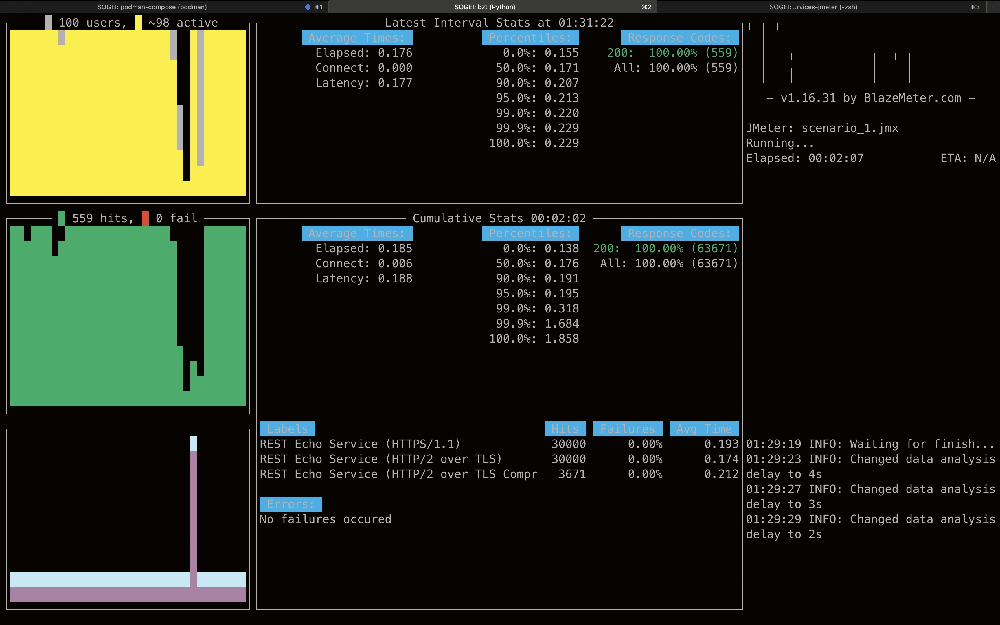
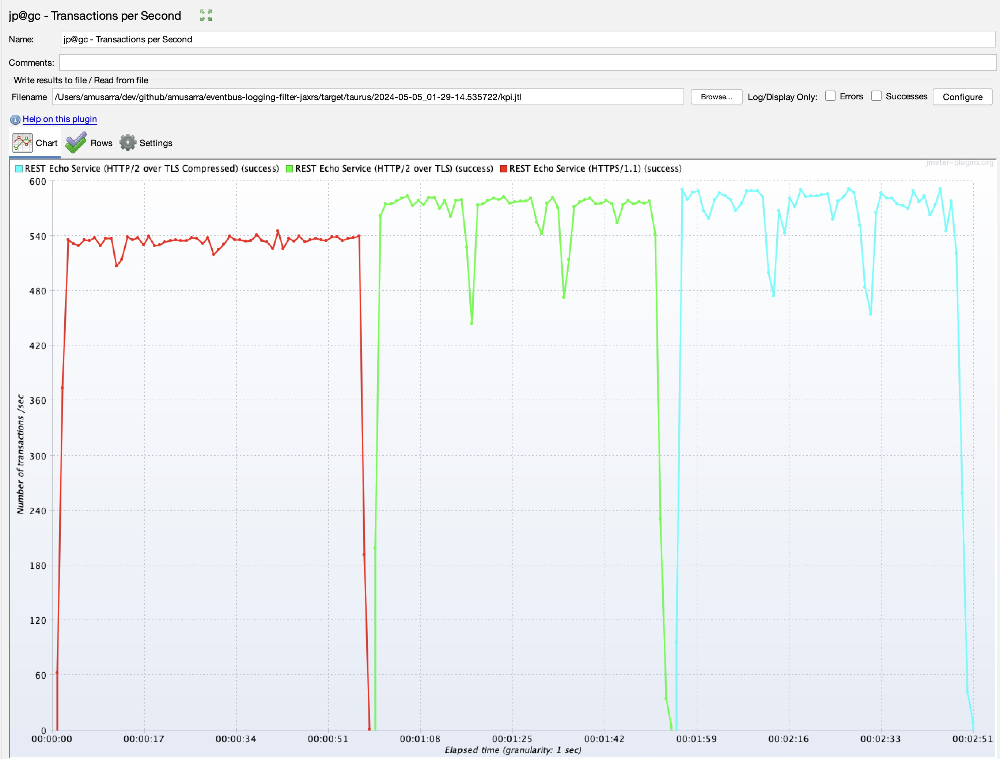

# Quarkus Event Bus Logging Filter JAX-RS

[](CHANGELOG.md)
[](https://opensource.org/licenses/MIT)
[](CODE_OF_CONDUCT.md)


## Container Images

| Image                                    | Latest Tag                                                                                                                          | Repository Link                                                               | Pull Command                                                                                                 |
|------------------------------------------|-------------------------------------------------------------------------------------------------------------------------------------|-------------------------------------------------------------------------------|--------------------------------------------------------------------------------------------------------------|
| `amusarra/eventbus-logging-filter-jaxrs` |  | [Docker Hub](https://hub.docker.com/r/amusarra/eventbus-logging-filter-jaxrs) | Pull the latest AMD64 native version `docker pull amusarra/eventbus-logging-filter-jaxrs:latest-amd64native` |
| `amusarra/eventbus-logging-filter-jaxrs` |              | [Docker Hub](https://hub.docker.com/r/amusarra/eventbus-logging-filter-jaxrs) | Pull the latest version `docker pull amusarra/eventbus-logging-filter-jaxrs:latest`                          |

> Remember that to use the podman command, you need to replace `docker` with `podman`. Also remember that the pattern for the version of the image is `latest` or `latest-amd64native`; you can replace `latest` with the desired version: `1.0.0`, `1.0.1`, or the branch name (main, develop, etc.) For example, `docker pull amusarra/eventbus-logging-filter-jaxrs:v1.2.12`, referer to the release 1.2.12 of the project.

For more information about the tags available, please visit the Docker Hub repository.

## SonarQube Report (cloud)

| Metric          | Value                                                                                                                                         |
|-----------------|-----------------------------------------------------------------------------------------------------------------------------------------------|
| Quality Gate    |              |
| Security        |        |
| Reliability     |  |
| Maintainability |           |
| Coverage        |                      |
| Duplications    |  |

For more information, visit the [SonarCloud Dashboard](https://sonarcloud.io/dashboard?id=amusarra_eventbus-logging-filter-jaxrs).

## Introduction

This project is a Quarkus application that demonstrates how to create a system capable of
tracking incoming and outgoing JAX-RS requests from the application across various storage
channels, such as a MongoDB database, SQL, or an AMQP broker, by leveraging Quarkus's Event Bus.

[](src/doc/resources/images/flusso_applicazione_quarkus.jpeg)

Figure 1 - Quarkus Application Flow

If you want to learn more about Quarkus, visit the official website [quarkus.io](https://quarkus.io/).
Below are the instructions for running the application in development mode and creating a native
executable.

## Requirements

The following table lists the necessary requirements for implementing and running the Quarkus project.

| Name                     | Optional | Description                                                  |
| ------------------------ | -------- | ------------------------------------------------------------ |
| Java JDK 17/21           | NO       | OpenJDK 17/21 implementation. You can use any of the [available implementations](https://en.wikipedia.org/wiki/OpenJDK). For this article, OpenJDK version 21 and Amazon Corretto 21.0.2 implementation were used. |
| Git                      | NO       | Versioning tool.                                           |
| Maven 3.9.6              | NO       | Build tool for Java projects and consequently Quarkus.       |
| Quarkus 3.9.2            | NO       | Quarkus Framework 3.9.2 whose release note is available here <https://quarkus.io/blog/quarkus-3-9-2-released/>. For more information on LTS releases, refer to the article [Long-Term Support (LTS) for Quarkus](https://quarkus.io/blog/lts-releases/). |
| Quarkus CLI              | YES      | Command-line tool that allows creating projects, managing extensions, and performing essential build and development tasks. For more information on how to install and use the Quarkus CLI (Command Line Interface), consult the [Quarkus CLI guide](https://quarkus.io/guides/cli-tooling). |
| Docker v26 or Podman v4/5 | NO       | Tool for managing images and running the application in container mode. Image/container management will be necessary when Event Handlers are developed to communicate with services external to the application (see NoSQL, SQL, AMQP). The management of necessary images and containers will be completely transparent to us developers as it is handled by [Quarkus Dev Services](https://quarkus.io/guides/dev-services). |
| GraalVM                  | YES      | For building the application in native mode. For more information, refer to the [Building a Native Executable](https://quarkus.io/guides/building-native-image) documentation. |
| C development environment | YES      | Required by GraalVM for native application build. For more information, refer to the [Building a Native Executable](https://quarkus.io/guides/building-native-image) documentation. |
| cURL 7.x/8.x             | YES      | Tool for testing Resource Endpoints (REST services).         |

**Table 1** - Requirements (including optional) necessary for implementing the Quarkus project

The Quarkus extensions used for the project implementation are as follows:

- io.quarkus:quarkus-hibernate-validator ✔
- io.quarkus:quarkus-mongodb-client ✔
- io.quarkus:quarkus-openshift ✔
- io.quarkus:quarkus-smallrye-health ✔
- io.quarkus:quarkus-vertx ✔
- io.quarkus:quarkus-messaging-amqp ✔
- io.quarkus:quarkus-arc ✔
- io.quarkus:quarkus-rest ✔
- io.quarkus:quarkus-rest-jackson ✔
- io.quarkus:quarkus-jdbc-h2 ✔
- io.quarkus:quarkus-jdbc-postgresql ✔

> It is important that you’ve correctly installed and configured your container runtime environment (Docker or
> Podman) to run the application in dev mode and execute tests, both operations require the use
> of Quarkus Dev Services (and consequently the container runtime).
>
> Refer to CHANGELOG.md to check for any changes and/or updates to the Quarkus version and
> any extensions used.

## Running the application in Docker

Would you like to run the application in a container and test its functionality right away?
The project includes the `src/main/docker/docker-compose.yml` file, which allows you to run
the application in a container using Docker Compose or Podman Compose.

Here's how to do it using [Podman Compose](https://docs.podman.io/en/latest/markdown/podman-compose.1.html) (it's no different for [Docker Compose](https://docs.docker.com/compose/)):

> Since project release [1.2.3](https://github.com/amusarra/eventbus-logging-filter-jaxrs/releases/tag/v1.2.3), the `docker-compose.yml` file has been updated by adding the PostgreSQL service.

Below is the command to start the Quarkus application in a container (including support services like MongoDB,
AMQP, etc.).

```shell
# Via Podman Compose (alternative to Docker Compose)
podman-compose -f src/main/docker/docker-compose.yml up -d
```

Console 1 - Run the Quarkus application in a container (including support services like MongoDB, AMQP, etc.)

The `docker-compose` or `podman-compose` command will start the following services:

- MongoDB
- AMQP (Apache ActiveMQ Artemis)
- PostgreSQL (from release 1.2.3)
- Quarkus Application

The Quarkus application image is available on [Docker Hub](https://hub.docker.com/r/amusarra/eventbus-logging-filter-jaxrs) and it is published thanks to the GitHub Actions `.github/workflows/docker_publish.yml` and `.github/workflows/docker_publish_native_amd64.yml` (for building and publishing the native x86-64 image).

After running the command, you can check if the services are active by using the `docker ps` or `podman ps` command.

```shell
# Check active containers
podman ps
```

Console 2 - Check active containers

The output of the `podman ps` command should be similar to the following:

```shell
CONTAINER ID  IMAGE                                                    COMMAND               CREATED         STATUS                   PORTS                                                                                             NAMES
d021a5f570bc  docker.io/library/mongo:4.4                              mongod                40 seconds ago  Up 40 seconds            0.0.0.0:27017->27017/tcp                                                                          mongodb
4faee4a45565  quay.io/artemiscloud/activemq-artemis-broker:1.0.25      /opt/amq/bin/laun...  39 seconds ago  Up 39 seconds            0.0.0.0:5445->5445/tcp, 0.0.0.0:5672->5672/tcp, 0.0.0.0:8161->8161/tcp, 0.0.0.0:61616->61616/tcp  artemis
7a3d8e2e709e  docker.io/amusarra/eventbus-logging-filter-jaxrs:latest                        38 seconds ago  Up 38 seconds (healthy)  0.0.0.0:8080->8080/tcp, 0.0.0.0:8443->8443/tcp                                                    logging-filter
```

Console 3 - Output of the `podman ps` command

The `logging-filter` service is the Quarkus application that has been started in a container and is ready to be used to test the exposed REST services (make sure the service is in `healthy` state).

In the docker-compose, for the `logging-filter` service, the Quarkus health check service is enabled, which verifies the application's health. The health check service is available at the address <http://localhost:8080/q/health>.

```yaml
  # The environment variables are used to configure the connection to the
  # Artemis message broker, MongoDB database e PostgreSQL database.
  # Se the application.properties file for more details about the names of the
  # environment variables.
  logging-filter:
    image: docker.io/amusarra/eventbus-logging-filter-jaxrs:latest
    container_name: logging-filter
    networks:
        - logging_filter_network
    environment:
        - AMQP_HOSTNAME=artemis
        - AMQP_PORT=5672
        - AMQP_USERNAME=artemis
        - AMQP_PASSWORD=artemis
        - MONGODB_CONNECTION_URL=mongodb://mongodb:27017/audit
        - DB_USERNAME=quarkus
        - DB_PASSWORD=quarkus
        - DB_URL=jdbc:postgresql://postgres:5432/quarkus_event_bus
        - JAVA_OPTS=-Xms100M -Xmx500M -XX:+UseG1GC -XX:+UnlockExperimentalVMOptions
          -XX:MaxGCPauseMillis=200 -XX:InitiatingHeapOccupancyPercent=45 -XX:G1ReservePercent=10
          -XX:ConcGCThreads=4 -XX:G1NewSizePercent=5 -XX:G1MaxNewSizePercent=60
          -XX:ParallelGCThreads=4 -XX:+ExitOnOutOfMemoryError -Dcom.sun.management.jmxremote.port=9091
          -Dcom.sun.management.jmxremote.rmi.port=9091 -Dcom.sun.management.jmxremote.authenticate=false
          -Dcom.sun.management.jmxremote.ssl=false -Dcom.sun.management.jmxremote.local.only=false
          -Djava.rmi.server.hostname=127.0.0.1
    ports:
      - "8080:8080"
      - "8443:8443"
      - "9091:9091"
    healthcheck:
      test: [ "CMD-SHELL", "curl --fail http://localhost:8080/q/health" ]
      interval: 30s
      timeout: 10s
      retries: 3
      start_period: 60s
    depends_on:
      - artemis
      - mongodb
      - postgres
```

Source 1 - Extract from docker-compose.yml for the `logging-filter` service

To test the REST service exposed by the Quarkus application, you can use the `curl` command to send an
HTTP request to the REST service.

```shell
# Send an HTTP request to the REST service
curl -v --http2 \
  -H "Content-Type: application/json" \
  -d '{"message": "Test di tracking richiesta JAX-RS"}' \
  http://localhost:8080/api/rest/echo
  
# Expected response
*   Trying [::1]:8080...
* Connected to localhost (::1) port 8080
> POST /api/rest/echo HTTP/1.1
> Host: localhost:8080
> User-Agent: curl/8.4.0
> Accept: */*
> Connection: Upgrade, HTTP2-Settings
> Upgrade: h2c
> HTTP2-Settings: AAMAAABkAAQAoAAAAAIAAAAA
> Content-Type: application/json
> Content-Length: 48
>
< HTTP/1.1 101 Switching Protocols
< connection: upgrade
< upgrade: h2c
* Received 101, Switching to HTTP/2
* Copied HTTP/2 data in stream buffer to connection buffer after upgrade: len=15
< HTTP/2 200
< content-type: application/json;charset=UTF-8
< content-length: 48
< set-cookie: user_tracking_id=f7cf38cd-a16d-4d53-91d3-5a3854f93e94;Version=1;Comment="Cookie di tracciamento dell'utente";Path=/;Max-Age=2592000;HttpOnly
< x-correlation-id: f5f0b80e-f550-45f4-9a75-41d33c6376f3
< x-pod-name: 7a3d8e2e709e
<
* Connection #0 to host localhost left intact
{"message": "Test di tracking richiesta JAX-RS"}%
```

Console 4 - Example of HTTP request to the REST service

Using the `podman logs <container-id>` command, you can check the logs of the Quarkus application where the information related to the tracking of JAX-RS requests is present. Below is an example of the application's log output.

```shell
2024-04-23 11:57:43,965 DEBUG [it.don.eve.ws.fil.TraceJaxRsRequestResponseFilter] (executor-thread-35) La Request URI /api/rest/echo è tra quelle che devono essere filtrate
2024-04-23 11:57:43,966 DEBUG [it.don.eve.ws.fil.TraceJaxRsRequestResponseFilter] (executor-thread-35) Pubblicazione del messaggio della richiesta HTTP su Event Bus
2024-04-23 11:57:43,967 DEBUG [it.don.eve.con.eve.han.Dispatcher] (vert.x-eventloop-thread-0) Received event message from source virtual address: http-request and source component: it.dontesta.eventbus.consumers.http.HttpRequestConsumer for the target virtual addresses: sql-trace,nosql-trace,queue-trace
2024-04-23 11:57:43,968 DEBUG [it.don.eve.con.eve.han.Dispatcher] (vert.x-eventloop-thread-0) Sending event message to target virtual address: sql-trace
2024-04-23 11:57:43,968 ERROR [it.don.eve.con.eve.han.Dispatcher] (vert.x-eventloop-thread-0) Failed to receive response from target virtual address: sql-trace with failure: (NO_HANDLERS,-1) No handlers for address sql-trace
2024-04-23 11:57:43,968 DEBUG [it.don.eve.con.eve.han.Dispatcher] (vert.x-eventloop-thread-0) Sending event message to target virtual address: nosql-trace
2024-04-23 11:57:43,969 DEBUG [it.don.eve.con.eve.han.Dispatcher] (vert.x-eventloop-thread-0) Sending event message to target virtual address: queue-trace
2024-04-23 11:57:43,967 DEBUG [it.don.eve.ws.fil.TraceJaxRsRequestResponseFilter] (executor-thread-35) La Request URI /api/rest/echo è tra quelle che devono essere filtrate
2024-04-23 11:57:43,970 DEBUG [it.don.eve.ws.fil.TraceJaxRsRequestResponseFilter] (executor-thread-35) Pubblicazione del messaggio della risposta HTTP su Event Bus
2024-04-23 11:57:43,973 DEBUG [it.don.eve.con.eve.han.Dispatcher] (vert.x-eventloop-thread-0) Received event message from source virtual address: http-response and source component: it.dontesta.eventbus.consumers.http.HttpResponseConsumer for the target virtual addresses: sql-trace,nosql-trace,queue-trace
2024-04-23 11:57:43,976 DEBUG [it.don.eve.con.eve.han.Dispatcher] (vert.x-eventloop-thread-0) Sending event message to target virtual address: sql-trace
2024-04-23 11:57:43,977 ERROR [it.don.eve.con.eve.han.Dispatcher] (vert.x-eventloop-thread-0) Failed to receive response from target virtual address: sql-trace with failure: (NO_HANDLERS,-1) No handlers for address sql-trace
2024-04-23 11:57:43,977 DEBUG [it.don.eve.con.eve.han.Dispatcher] (vert.x-eventloop-thread-0) Sending event message to target virtual address: nosql-trace
2024-04-23 11:57:43,977 DEBUG [it.don.eve.con.eve.han.Dispatcher] (vert.x-eventloop-thread-0) Sending event message to target virtual address: queue-trace
2024-04-23 11:57:43,982 DEBUG [it.don.eve.con.eve.han.Dispatcher] (vert.x-eventloop-thread-0) Received response from target virtual address: nosql-trace with result: Documents inserted successfully with Id BsonObjectId{value=6627a2378d1ed50d0c256e95}
2024-04-23 11:57:43,982 DEBUG [it.don.eve.con.eve.han.Dispatcher] (vert.x-eventloop-thread-0) Received response from target virtual address: nosql-trace with result: Documents inserted successfully with Id BsonObjectId{value=6627a2378d1ed50d0c256e96}
2024-04-23 11:57:43,984 DEBUG [it.don.eve.con.eve.han.Dispatcher] (vert.x-eventloop-thread-0) Received response from target virtual address: queue-trace with result: Message sent to AMQP queue successfully!
2024-04-23 11:57:43,984 DEBUG [it.don.eve.con.eve.han.Dispatcher] (vert.x-eventloop-thread-0) Received response from target virtual address: queue-trace with result: Message sent to AMQP queue successfully!
```

Log 1 - Example of Quarkus application log

At this point, you can shut down the Quarkus application and support services using the command
`podman-compose -f src/main/docker/docker-compose.yml down` or the respective docker-compose.

A video showing how to run the Quarkus application in a container using Podman is available on asciinema.org.

[](https://asciinema.org/a/655929)

You might also be curious to perform a simple benchmark of the Quarkus application in a container. To do this,
you can use the [h2load](https://github.com/nghttp2/nghttp2?tab=readme-ov-file#benchmarking-tool) command, which is a benchmarking tool for HTTP/2 and HTTP/1.1. Here's an example of how to do it.

```shell
# Run the benchmark of the Quarkus application using HTTP/2
# -n 100 indicates the number of requests to send
# -c 5 indicates the number of connections to keep open
# -H "Content-Type: application/json" indicates the Content-Type header
# -H 'Accept-Encoding: gzip, deflate, br, zstd' indicates the Accept-Encoding header
# -d src/test/resources/payload-1.json indicates the payload to send
h2load -n 100 -c 5 \
        -H "Content-Type: application/json" \
        -H 'Accept-Encoding: gzip, deflate, br, zstd' \
        -d src/test/resources/payload-1.json \
        https://0.0.0.0:8443/api/rest/echo
```

Console 5 - Example of benchmarking the Quarkus application

Below is an example of the output of the h2load command.

```shell
starting benchmark...
spawning thread #0: 5 total client(s). 100 total requests
TLS Protocol: TLSv1.3
Cipher: TLS_AES_256_GCM_SHA384
Server Temp Key: X25519 253 bits
Application protocol: h2
progress: 10% done
progress: 20% done
progress: 30% done
progress: 40% done
progress: 50% done
progress: 60% done
progress: 70% done
progress: 80% done
progress: 90% done
progress: 100% done

finished in 210.56ms, 474.93 req/s, 145.54KB/s
requests: 100 total, 100 started, 100 done, 100 succeeded, 0 failed, 0 errored, 0 timeout
status codes: 100 2xx, 0 3xx, 0 4xx, 0 5xx
traffic: 30.64KB (31380) total, 18.71KB (19160) headers (space savings 32.54%), 9.57KB (9800) data
                     min         max         mean         sd        +/- sd
time for request:      970us    107.30ms      4.16ms     12.84ms    97.00%
time for connect:    62.28ms    165.11ms    103.21ms     42.95ms    80.00%
time to 1st byte:   115.42ms    169.90ms    148.03ms     29.64ms    60.00%
req/s           :      95.02      131.20      109.66       19.40    60.00%
```

Log 2 - Example of output of the h2load command

### Some notes on Podman configuration

In case you have Podman instead of Docker, you might encounter the following problem when you start the application.

```text
...
2024-05-15 12:22:07,164 ERROR [org.tes.doc.DockerClientProviderStrategy] (build-43) Could not find a valid Docker environment. Please check configuration. Attempted configurations were:
	UnixSocketClientProviderStrategy: failed with exception InvalidConfigurationException (Could not find unix domain socket). Root cause AccessDeniedException (/var/run/docker.sock)
	DockerDesktopClientProviderStrategy: failed with exception NullPointerException (Cannot invoke "java.nio.file.Path.toString()" because the return value of "org.testcontainers.dockerclient.DockerDesktopClientProviderStrategy.getSocketPath()" is null)As no valid configuration was found, execution cannot continue.
...
```

Log 3 - Example of Podman configuration error

In this case,
you should activate the `podman.socket` service for the [API service](https://github.com/containers/podman/blob/main/docs/tutorials/socket_activation.md)
and make the socket accessible to all users.
To do this, run the following commands.

```shell
# The following commands must be run as a normal user (!= root)
# Enable the podman.socket service for API service in user mode
systemctl --user start podman.socket

# Check that the socket has been created
ls -l $XDG_RUNTIME_DIR/podman/podman.sock

# Check that the podman.socket service is active
systemctl --user status podman.socket

# Export the DOCKER_HOST environment variable
export DOCKER_HOST=unix://$XDG_RUNTIME_DIR/podman/podman.sock
```

Console 6 - Enable the podman.socket service for API service

## Running the application in dev mode

You can run the application in development mode, which enables live coding, using:

```shell
./mvnw compile quarkus:dev
```

Console 7 - Running the application in development mode

> **_NOTE:_** Quarkus now includes a development UI, available only in development mode at the address http://localhost:8080/q/dev/.


Figure 2 - Quarkus Dev UI

## Packaging and starting the application

The application can be packaged using:

```shell
./mvnw package
```

Console 8 - Packaging the application

The process will produce the `quarkus-run.jar` file in `target/quarkus-app/`.
This is not an _über-jar_ as the dependencies are copied to the directory `target/quarkus-app/lib/`.

The application is now executable using `java -jar target/quarkus-app/quarkus-run.jar`.

If you want to create an _über-jar_, run the following command:

```shell
./mvnw package -Dquarkus.package.type=uber-jar
```

Console 9 - Packaging the application as an _über-jar_

The application, packaged as an _über-jar_, is now executable using `java -jar target/*-runner.jar`.

## Creating a native executable

You can create a native executable using:

```shell
./mvnw package -Dnative
```

Console 9 - Creating a native executable

If you don’t have GraalVM installed, you can build the native executable in a container using:

```shell
./mvnw package -Dnative -Dquarkus.native.container-build=true
```

Console 11 - Creating a native executable in a container

You can run the native executable with: `./target/eventbus-logging-filter-jaxrs-1.0.0-SNAPSHOT-runner`

If you want to learn more about creating native executables, consult <https://quarkus.io/guides/maven-tooling>.

## Load Testing Scenarios with JMeter and Taurus

The project includes the jmx file `src/test/jmeter/scenario_1.jmx`, which allows you to perform a simple
Load Testing with JMeter.

The purpose of this simple scenario is to test the REST service `api/rest/echo` exposed by the Quarkus application and to verify the system's behavior under stress in terms of performance and scalability, but especially
to demonstrate the difference between HTTP/1.1 and HTTP/2 over TLS requests with and without GZIP compression.

The created Test Plan includes a series of [Thread Groups](https://jmeter.apache.org/usermanual/test_plan.html#thread_group), each containing a sampler HTTP
appropriately configured for the REST service `api/rest/echo`. The Thread Groups are:

1. test in HTTPS/1.1
2. test in HTTPS/2 over TLS
3. test in HTTP/2 over TLS with GZIP compression

The following figure shows the Test Plan configuration with JMeter.


Figure 3 - Configurazione del Test Plan di JMeter

Each of the three tests is a JMeter Thread Group
that can be configured through the [User Defined Variables](https://jmeter.apache.org/usermanual/component_reference.html#User_Defined_Variables)
(see Figure 3) of the Test Plan and in particular:

1. **numberOfThreads**: this parameter indicates the total number of threads (virtual users) that will be started during the test execution. Each thread simulates a user interacting with the system under test;
2. **rampUpPeriod**: the ramp-up period (in seconds) specifies how long JMeter should take to start all the threads specified in the "Number of Threads". For example, if you have 100 threads and set a ramp-up period of 10 seconds, JMeter will start a new thread every 0.1 seconds (10 seconds/100 threads);
3. **loopCount**: this parameter defines how many times each thread will execute the set of samplers (HTTP requests or other operations) within the Thread Group. If you set the Loop Count to 0, the threads will continue to execute the samplers indefinitely until the test is manually stopped.

The following figure shows how these values are set in the JMeter Thread Group.


Figure 4 - Configurazione del Thread Group di JMeter

To execute this Load Testing scenario, you can use [Taurus](https://gettaurus.org/), an open-source framework 
that automates load testing and performance testing operations.
Taurus supports JMeter, 
Gatling, Locust, Selenium, and other load testing tools.

For Taurus installation, you can follow the [official guide](https://gettaurus.org/install/Installation/).

The Taurus configuration file `src/test/jmeter/taurus/config.yml` has been created to execute the JMeter Test Plan. Here's an example of how to run the JMeter Test Plan with Taurus.

```shell
# Run the JMeter Test Plan with Taurus
bzt -o modules.jmeter.properties.numberOfThreads=100 \
  -o modules.jmeter.properties.rampUpPeriod=0.5 \
  -o modules.jmeter.properties.loopCount=300 \
  -o modules.jmeter.properties.httpProtocol=https \
  -o modules.jmeter.properties.httpPort=8443 \
  -o modules.jmeter.properties.ipOrFQDN=localhost \
  src/test/jmeter/taurus/config.yml \
  src/test/jmeter/scenario_1.jmx
```

Console 12 - Running the JMeter Test Plan with Taurus

The `bzt` command runs the JMeter Test Plan with Taurus, and the `-o` parameters are used to overwrite the values
of the variables defined in the Taurus configuration file `src/test/jmeter/taurus/config.yml`, which in this case
act on the User Defined Variables of the JMeter Test Plan. From the value of `ipOrFQDN`, it can be seen that the test will
be executed locally, so make sure you have the Quarkus application running.

The Thread Groups in this case are configured to simulate 100 virtual users sending 300 requests to
the REST service `api/rest/echo` exposed by the Quarkus application with a ramp-up period of 0.5 seconds.

> **_NOTE:_** The data shown below refers to the execution of the Test Plan in the Developer
> Sandbox environment of Red Hat OpenShift, with three Quarkus application pods active, one pod for the MongoDB service, and one pod
> for the AMQP (Apache ActiveMQ Artemis) service.

The two figures below show Taurus in action,
respectively at the beginning (showing the progress status) and at the end of the test
(showing the report).



Figure 5 - Taurus in action

From the Taurus report, you can see the results of the load test performed with JMeter.
From the test duration, the number of HTTP requests sent, the average response time, etc. From this report,
you can already see how the response time is influenced by the protocol used (HTTP/1.1, HTTP/2) and by GZIP compression.


Figure 6 - Taurus Report

The execution of the JMeter Test Plan with Taurus produces the log files and jtl of the kpi that can be analyzed with JMeter inside the directory `target/taurus/%Y-%m-%d_%H-%M-%S.%f`.

For example, the following figure, through [jp@gc - Transactions per Second](https://jmeter-plugins.org/wiki/TransactionsPerSecond/), shows the system throughput during the load test (from the data read from the jtl file `kpi.jtl` located in `target/taurus/%Y-%m-%d_%H-%M-%S.%f`).



Figure 7 - System throughput

It can also be seen from this graph how the system throughput is influenced by the protocol used,
and the HTTP/2 over TLS protocol with GZIP compression offers the best performance.

Since project release [1.2.2](https://github.com/amusarra/eventbus-logging-filter-jaxrs/releases/tag/v1.2.2), the Load Testing scenario is available to test the JAX-RS services connected to
the two ORM (Object Relational Mapping) entities that have been implemented in the project and introduced by the release [1.2.0](https://github.com/amusarra/eventbus-logging-filter-jaxrs/releases/tag/v1.2.0).

To execute the Load Testing scenario, you can use the jmx file `src/test/jmeter/scenario_2.jmx`, which structure can be seen by opening it with JMeter. Below is shown the structure of the JMeter Test Plan.


Figure 8 - Configurazione del Test Plan di JMeter (scenario 2 `src/test/jmeter/scenario_2.jmx`)

The thread groups are configured with the same principle as the first Load Testing scenario, so they are
created for each version of the HTTP protocol (HTTPS/1.1, HTTP/2 over TLS, and compressed); for each of them, a
request flow is created for the JAX-RS services of the ORM entities `Owner` and `Horse` (introduced by the version 
[1.2.0](https://github.com/amusarra/eventbus-logging-filter-jaxrs/releases/tag/v1.2.0) of the project).

For this scenario, through the configuration element [HTTP Header Manager](https://jmeter.apache.org/usermanual/component_reference.html#HTTP_Header_Manager), a set of custom HTTP headers has been configured, specifically concerning information about JMeter; these are:

1. X-TestCaseId: a unique identifier for the test case
2. X-TestPlanName: the name of the test plan
3. X-TestThreadGroupName: the name of the thread group
4. X-TestThreadNumber: the thread number

This information can be useful for tracking the HTTP requests sent by JMeter and for identifying the test.
Below is an example of a request executed by JMeter and tracked in MongoDB where the custom HTTP headers are evident.

```json
{
  "_id" : ObjectId("66425a820d65f7240e2ba113"),
  "X-Correlation-ID" : "bc187f1f-9c6c-499b-9d13-0b87b31d2abb",
  "remote-ip-address" : "127.0.0.1",
  "headers" : {
    "Accept" : [
      "*/*"
    ],
    "X-TestThreadGroupName" : [
      "HTTPS/1.1"
    ],
    "Connection" : [
      "keep-alive"
    ],
    "User-Agent" : [
      "Java/21.0.2"
    ],
    "X-TestPlanName" : [
      "modified_scenario_2.jmx"
    ],
    "Host" : [
      "127.0.0.1:8443"
    ],
    "X-TestCaseId" : [
      "005044d0-9848-4f22-8e50-02fa395a5ede"
    ],
    "Content-Length" : [
      "296"
    ],
    "Content-Type" : [
      "application/json;charset=UTF-8"
    ],
    "X-TestThreadNumber" : [
      "1"
    ]
  },
  "body" : "{\r\n  \"name\": \"Crimson Comet-updated\",\r\n  \"sex\": \"F\",\r\n  \"coat\": \"chestnut\",\r\n  \"breed\": \"Appaloosa\",\r\n  \"dateOfBirth\": \"2004-01-19\",\r\n  \"registrationNumber\": \"0FOTDW12MI531U\",\r\n  \"microchipNumber\": \"C782CF2I1IN\",\r\n  \"passportNumber\": \"39K4CK1I3ZDU4\",\r\n  \"height\": 134,\r\n  \"owners\": [{\"id\": 3}]\r\n}",
  "uri-info" : "https://127.0.0.1:8443/api/rest/repository/horse/v1/6",
  "local-date-time-in" : "2024-05-13T20:22:58.622629",
  "method" : "PUT",
  "media-type" : "application/json",
  "acceptable-language" : "[]",
  "acceptable-media-types" : "[*/*]"
}
```

Log 4 - Example of HTTP request tracked in MongoDB

This scenario can also be executed with Taurus using the `bzt` command as shown earlier.
Below is the command to execute the Load Testing scenario with Taurus.

```shell
# Run the Load Testing scenario with Taurus
bzt -o modules.jmeter.properties.numberOfThreads=1 \
  -o modules.jmeter.properties.rampUpPeriod=5 \
  -o modules.jmeter.properties.loopCount=25 \
  -o modules.jmeter.properties.httpProtocol=https \
  -o modules.jmeter.properties.httpPort=8443 \
  -o modules.jmeter.properties.ipOrFQDN=127.0.0.1 \
  src/test/jmeter/taurus/config.yml \
  src/test/jmeter/scenario_2.jmx
```

Console 13 - Running the Load Testing scenario with Taurus

## Accessing Java Management Extensions (JMX)

From project version [1.2.4](https://github.com/amusarra/eventbus-logging-filter-jaxrs/releases/tag/v1.2.4),
it is possible to access the Java Management Extensions (JMX)
of the Quarkus application when it is started using docker-compose.
This is made possible by the configuration shown below, particularly the `JAVA_OPTS` parameters that enable JMX.

```yaml
  logging-filter:
    # Use the following image if you want to use the pre-built image from Docker Hub:
    # docker.io/amusarra/eventbus-logging-filter-jaxrs:latest
    image: docker.io/amusarra/eventbus-logging-filter-jaxrs:latest
    container_name: logging-filter
    networks:
      - logging_filter_network
    environment:
      - JAVA_OPTS=-Xms100M -Xmx500M -XX:+UseG1GC -XX:+UnlockExperimentalVMOptions
        -XX:MaxGCPauseMillis=200 -XX:InitiatingHeapOccupancyPercent=45 -XX:G1ReservePercent=10
        -XX:ConcGCThreads=4 -XX:G1NewSizePercent=5 -XX:G1MaxNewSizePercent=60
        -XX:ParallelGCThreads=4 -XX:+ExitOnOutOfMemoryError -Dcom.sun.management.jmxremote.port=9091
        -Dcom.sun.management.jmxremote.rmi.port=9091 -Dcom.sun.management.jmxremote.authenticate=false
        -Dcom.sun.management.jmxremote.ssl=false -Dcom.sun.management.jmxremote.local.only=false
        -Djava.rmi.server.hostname=127.0.0.1
```

Source 2 - Extract from docker-compose.yml for the `logging-filter` service with JMX enabled

Once the container is running, you can access the JMX of the Quarkus application using a
JMX client such as [JConsole](https://openjdk.org/tools/svc/jconsole/), [VisualVM](https://visualvm.github.io/) or
[Java Mission Control](https://www.oracle.com/java/technologies/jdk-mission-control.html). In this case, the JMX connection string is `service:jmx:rmi:///jndi/rmi://localhost:9091/jmxrmi`. Below is an example of connecting via VisualVM.


Figure 9 - JMX Connection with VisualVM

The following figure shows the monitoring of the application, where information about
memory, garbage collector, class loader, thread, etc. can be found.


Figure 10 - JMX Monitoring with VisualVM

In an OpenShift environment, you can access the JMX of the Quarkus application using,
for example, the [Cryostat](https://cryostat.io/) project (JFR for Containerized Java Applications).

## Guide to the services and extensions used

- MongoDB client ([guide](https://quarkus.io/guides/mongodb)): Connect to MongoDB in either imperative or reactive style
- Eclipse Vert.x ([guide](https://quarkus.io/guides/vertx)): Write reactive applications with the Vert.x API
- OpenShift ([guide](https://quarkus.io/guides/deploying-to-openshift)): Generate OpenShift resources from annotations
- ArC ([guide](https://quarkus.io/guides/cdi-reference)): Build time CDI dependency injection
- Messaging - AMQP Connector ([guide](https://quarkus.io/guides/amqp)): Connect to AMQP with Reactive Messaging
- REST ([guide](https://quarkus.io/guides/rest)): A Jakarta REST implementation utilizing build time processing and Vert.x. This extension is not compatible with the quarkus-resteasy extension, or any of the extensions that depend on it.
- REST Jackson ([guide](https://quarkus.io/guides/rest#json-serialisation)): Jackson serialization support for Quarkus REST. This extension is not compatible with the quarkus-resteasy extension, or any of the extensions that depend on it
- Hibernate Validator ([guide](https://quarkus.io/guides/validation)): Validate object properties (field, getter) and method parameters for your beans (REST, CDI, Jakarta Persistence)
- Using Podman with Quarkus ([guide](https://quarkus.io/guides/podman))
- Simplified Hibernate ORM with Panache ([guide](https://quarkus.io/guides/hibernate-orm-panache)): Simplify your persistence layer with Panache
- Configura data sources in Quarkus ([guide](https://quarkus.io/guides/datasource)): 
  - Connect to a H2 database using JDBC
  - Connect to a PostgreSQL database using JDBC

## Team Tools

[](https://www.jetbrains.com/?from=LiferayPortalSecurityAudit)

Antonio Musarra's Blog Team would like to inform that JetBrains is helping by
provide IDE to develop the application. Thanks to its support program for
 Open Source projects!

[](https://sonarcloud.io/project/overview?id=amusarra_eventbus-logging-filter-jaxrs)

This project is using SonarCloud for code quality.
Thanks to SonarQube Team for a free analysis solution for open source projects.