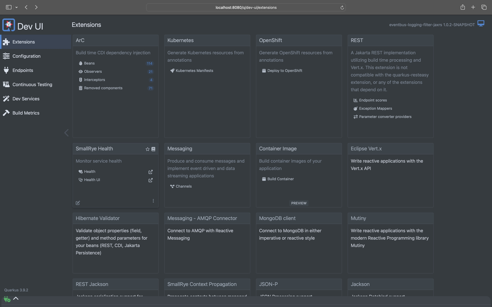
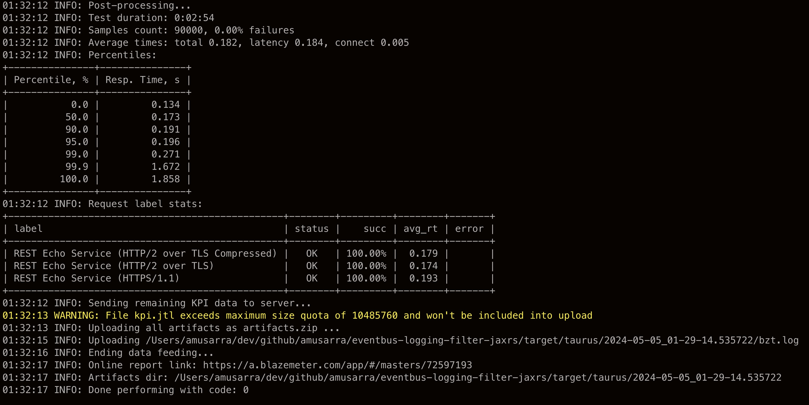
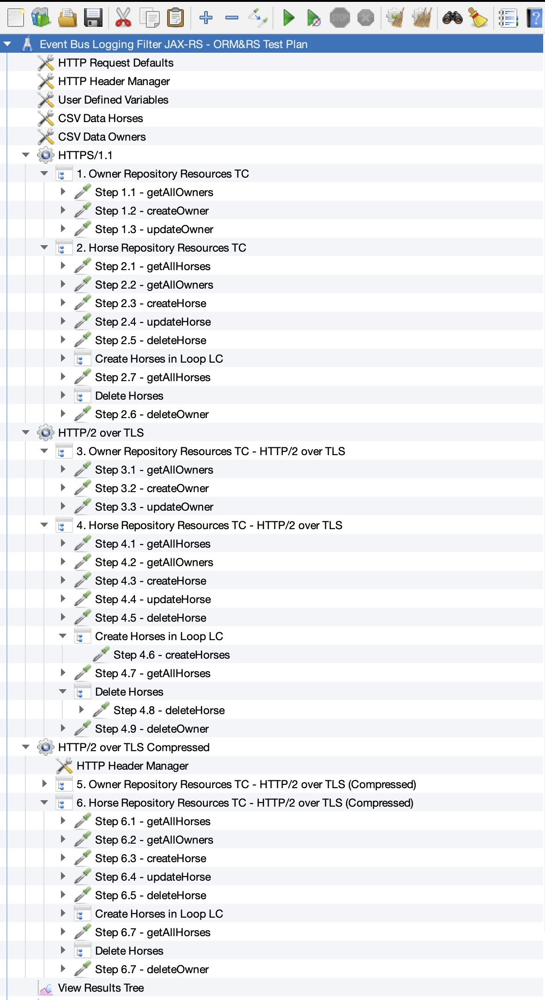

# Quarkus Event Bus Logging Filter JAX-RS

[](CHANGELOG.md)
[](https://opensource.org/licenses/MIT)
[](CODE_OF_CONDUCT.md)

 
 


[](https://sonarcloud.io/summary/new_code?id=amusarra_eventbus-logging-filter-jaxrs)

[](https://hub.docker.com/r/amusarra/eventbus-logging-filter-jaxrs)

Questo progetto è un'applicazione Quarkus che mostra come realizzare un sistema che sia capace di
tracciare le richieste JAX-RS in arrivo e in uscita dall'applicazione su diversi canali di
storage, come ad esempio un database MongoDB, SQL o un broker AMQP sfruttando l'Event Bus 
di Quarkus.

[](src/doc/resources/images/flusso_applicazione_quarkus.jpeg)

Figura 1 - Flusso dell'applicazione Quarkus

Se vuoi saperne di più su Quarkus, visita il sito ufficiale [quarkus.io](https://quarkus.io/).
A seguire trovi le istruzioni per eseguire l'applicazione in modalità sviluppo e creare un eseguibile
nativo.

## Requisiti
La tabella seguente elenca i requisiti necessari per l'implementazione ed esecuzione del progetto 
Quarkus.

| Nome                     | Opzionale | Descrizione                                                  |
| ------------------------ | --------- | ------------------------------------------------------------ |
| Java JDK 17/21           | NO        | Implementazione di OpenJDK 17/21. È possibile usare qualunque delle [implementazioni disponibili](https://en.wikipedia.org/wiki/OpenJDK). Per questo articolo è stata usata la versione 21 di OpenJDK e l'implementazione di Amazon Corretto 21.0.2. |
| Git                      | NO        | Tool di versioning.                                          |
| Maven 3.9.6              | NO        | Tool di build per i progetti Java e di conseguenza Quarkus.  |
| Quarkus 3.9.2            | NO        | Framework Quarkus 3.9.2 la cui release note è disponibile qui https://quarkus.io/blog/quarkus-3-9-2-released/. Per maggiori informazioni per le release LTS fare riferimento all'articolo [Long-Term Support (LTS) for Quarkus](https://quarkus.io/blog/lts-releases/). |
| Quarkus CLI              | SI        | Tool a linea di comando che consente di creare progetti, gestire estensioni ed eseguire attività essenziali di creazione e sviluppo. Per ulteriori informazioni su come installare e utilizzare la CLI (Command Line Interface) di Quarkus, consulta la [guida della CLI di Quarkus](https://quarkus.io/guides/cli-tooling). |
| Docker v26 o Podman v4/5 | NO        | Tool per la gestione delle immagini e l'esecuzione dell'applicazione in modalità container. La gestione delle immagini/container sarà necessaria nel momento in cui saranno sviluppati gli Event Handler che dovranno comunicare con i servizi esterni all'applicazione (vedi NoSQL, SQL, AMQP). La gestione delle immagini necessarie e container, sarà totalmente trasparente per noi sviluppatori in quanto a carico dei [Dev Services di Quarkus](https://quarkus.io/guides/dev-services). |
| GraalVM                  | SI        | Per la build dell'applicazione in modalità nativa. Per maggiori informazioni fare riferimento alla documentazione [Building a Native Executable](https://quarkus.io/guides/building-native-image). |
| Ambiente di sviluppo C   | SI        | Richiesto da GraalVM per la build dell'applicazione nativa. Per maggiori informazioni fare riferimento alla documentazione [Building a Native Executable](https://quarkus.io/guides/building-native-image). |
| cURL 7.x/8.x             | SI        | Tool per il test dei Resource Endpoint (servizi REST)        |

**Tabella 1** - Requisiti (anche opzionali) necessari per l'implementazione del progetto Quarkus

Le estensioni Quarkus utilizzate per l'implementazione del progetto sono le seguenti:
- io.quarkus:quarkus-hibernate-validator ✔
- io.quarkus:quarkus-mongodb-client ✔
- io.quarkus:quarkus-openshift ✔
- io.quarkus:quarkus-smallrye-health ✔
- io.quarkus:quarkus-vertx ✔
- io.quarkus:quarkus-messaging-amqp ✔
- io.quarkus:quarkus-arc ✔
- io.quarkus:quarkus-rest ✔
- io.quarkus:quarkus-rest-jackson ✔
- io.quarkus:quarkus-jdbc-h2 ✔
- io.quarkus:quarkus-jdbc-postgresql ✔

> È importante che abbiate installato e configurato correttamente il vostro ambiente di container runtime (Docker o 
> Podman) al fine di eseguire l'applicazione in dev mode ed eseguire i test, entrambe le operazioni richiedono l'uso
> dei Dev Services di Quarkus (e di conseguenza del container runtime).

## Esecuzione dell'applicazione in Docker
Vorresti eseguire l'applicazione in un container e testare il funzionamento dell'applicazione fin da subito?
All'interno del progetto è disponibile il file `src/main/docker/docker-compose.yml` che ti permette di eseguire 
l'applicazione in un container utilizzando Docker Compose o Podman Compose.

Ecco come fare utilizzando [Podman Compose](https://docs.podman.io/en/latest/markdown/podman-compose.1.html) (non cambia nel caso di [Docker Compose](https://docs.docker.com/compose/)):

> Dalla release [1.2.3](https://github.com/amusarra/eventbus-logging-filter-jaxrs/releases/tag/v1.2.3) del progetto, il file `docker-compose.yml` è stato aggiornato aggiungendo il servizio di PostgreSQL.

A seguire il comando per avviare l'applicazione Quarkus in un container (compresi i servizi di supporto come MongoDB, 
AMQP, ecc.).

```shell script
# Tramite Podman Compose (alternativa a Docker Compose)
podman-compose -f src/main/docker/docker-compose.yml up -d
```
Console 1 - Esegui l'applicazione Quarkus in un container (compresi i servizi di supporto come MongoDB, AMQP, ecc.)

Tramite il comando `docker-compose` o `podman-compose` verranno avviati i seguenti servizi:
- MongoDB
- AMQP (Apache ActiveMQ Artemis)
- Applicazione Quarkus

L'immagine dell'applicazione Quarkus è disponibile su [Docker Hub](https://hub.docker.com/r/amusarra/eventbus-logging-filter-jaxrs)
e questa è pubblicata grazie alla GitHub Actions `.github/workflows/docker_publish.yml` e 
`.github/workflows/docker_publish_native_amd64.yml` (per build e pubblicazione dell'immagine nativa x86-64).
 
Dopo aver eseguito il comando, puoi verificare che i servizi siano attivi tramite il comando `docker ps` o `podman ps`.

```shell script
# Verifica i container attivi
podman ps
```
Console 2 - Verifica i container attivi

L'output del comando `podman ps` dovrebbe essere simile al seguente:

```shell script
CONTAINER ID  IMAGE                                                    COMMAND               CREATED         STATUS                   PORTS                                                                                             NAMES
d021a5f570bc  docker.io/library/mongo:4.4                              mongod                40 seconds ago  Up 40 seconds            0.0.0.0:27017->27017/tcp                                                                          mongodb
4faee4a45565  quay.io/artemiscloud/activemq-artemis-broker:1.0.25      /opt/amq/bin/laun...  39 seconds ago  Up 39 seconds            0.0.0.0:5445->5445/tcp, 0.0.0.0:5672->5672/tcp, 0.0.0.0:8161->8161/tcp, 0.0.0.0:61616->61616/tcp  artemis
7a3d8e2e709e  docker.io/amusarra/eventbus-logging-filter-jaxrs:latest                        38 seconds ago  Up 38 seconds (healthy)  0.0.0.0:8080->8080/tcp, 0.0.0.0:8443->8443/tcp                                                    logging-filter
```
Console 3 - Output del comando `podman ps`

Il servizio `logging-filter` è l'applicazione Quarkus che è stata avviata in un container e che è pronta per essere 
utilizzata per testare i servizi REST esposti (fai attenzione che il servizio sia in stato `healthy`).

Sul docker-compose, per il servizio `logging-filter`, è stato abilitato il servizio di Health Check di Quarkus che
verifica la salute dell'applicazione. Il servizio di Health Check è disponibile all'indirizzo
http://localhost:8080/q/health.

```yaml
  # The environment variables are used to configure the connection to the
  # Artemis message broker and the MongoDB database.
  # Se the application.properties file for more details about the names of the
  # environment variables.
  logging-filter:
    image: docker.io/amusarra/eventbus-logging-filter-jaxrs:latest
    container_name: logging-filter
    networks:
        - logging_filter_network
    environment:
        - AMQP_HOSTNAME=artemis
        - AMQP_PORT=5672
        - AMQP_USERNAME=artemis
        - AMQP_PASSWORD=artemis
        - MONGODB_CONNECTION_URL=mongodb://mongodb:27017/audit
    ports:
      - "8080:8080"
      - "8443:8443"
    healthcheck:
      test: [ "CMD-SHELL", "curl --fail http://localhost:8080/q/health" ]
      interval: 30s
      timeout: 10s
      retries: 3
      start_period: 60s
    depends_on:
      - artemis
      - mongodb
```
Source 1 - Estratto del docker-compose.yml per il servizio `logging-filter`

Per testare il servizio REST esposto dall'applicazione Quarkus, puoi utilizzare il comando `curl` per inviare una
richiesta HTTP al servizio REST.

```shell script
# Invia una richiesta HTTP al servizio REST
curl -v --http2 \
  -H "Content-Type: application/json" \
  -d '{"message": "Test di tracking richiesta JAX-RS"}' \
  http://localhost:8080/api/rest/echo
  
# Risposta attesa
*   Trying [::1]:8080...
* Connected to localhost (::1) port 8080
> POST /api/rest/echo HTTP/1.1
> Host: localhost:8080
> User-Agent: curl/8.4.0
> Accept: */*
> Connection: Upgrade, HTTP2-Settings
> Upgrade: h2c
> HTTP2-Settings: AAMAAABkAAQAoAAAAAIAAAAA
> Content-Type: application/json
> Content-Length: 48
>
< HTTP/1.1 101 Switching Protocols
< connection: upgrade
< upgrade: h2c
* Received 101, Switching to HTTP/2
* Copied HTTP/2 data in stream buffer to connection buffer after upgrade: len=15
< HTTP/2 200
< content-type: application/json;charset=UTF-8
< content-length: 48
< set-cookie: user_tracking_id=f7cf38cd-a16d-4d53-91d3-5a3854f93e94;Version=1;Comment="Cookie di tracciamento dell'utente";Path=/;Max-Age=2592000;HttpOnly
< x-correlation-id: f5f0b80e-f550-45f4-9a75-41d33c6376f3
< x-pod-name: 7a3d8e2e709e
<
* Connection #0 to host localhost left intact
{"message": "Test di tracking richiesta JAX-RS"}%
```
Console 4 - Esempio di richiesta HTTP al servizio REST

Utilizzando il comando `podman logs <container-id>`, puoi verificare i log dell'applicazione Quarkus dove sono presenti
le informazioni relative al tracciamento delle richieste JAX-RS. A seguire un esempio di output dei log dell'applicazione.

```shell script
2024-04-23 11:57:43,965 DEBUG [it.don.eve.ws.fil.TraceJaxRsRequestResponseFilter] (executor-thread-35) La Request URI /api/rest/echo è tra quelle che devono essere filtrate
2024-04-23 11:57:43,966 DEBUG [it.don.eve.ws.fil.TraceJaxRsRequestResponseFilter] (executor-thread-35) Pubblicazione del messaggio della richiesta HTTP su Event Bus
2024-04-23 11:57:43,967 DEBUG [it.don.eve.con.eve.han.Dispatcher] (vert.x-eventloop-thread-0) Received event message from source virtual address: http-request and source component: it.dontesta.eventbus.consumers.http.HttpRequestConsumer for the target virtual addresses: sql-trace,nosql-trace,queue-trace
2024-04-23 11:57:43,968 DEBUG [it.don.eve.con.eve.han.Dispatcher] (vert.x-eventloop-thread-0) Sending event message to target virtual address: sql-trace
2024-04-23 11:57:43,968 ERROR [it.don.eve.con.eve.han.Dispatcher] (vert.x-eventloop-thread-0) Failed to receive response from target virtual address: sql-trace with failure: (NO_HANDLERS,-1) No handlers for address sql-trace
2024-04-23 11:57:43,968 DEBUG [it.don.eve.con.eve.han.Dispatcher] (vert.x-eventloop-thread-0) Sending event message to target virtual address: nosql-trace
2024-04-23 11:57:43,969 DEBUG [it.don.eve.con.eve.han.Dispatcher] (vert.x-eventloop-thread-0) Sending event message to target virtual address: queue-trace
2024-04-23 11:57:43,967 DEBUG [it.don.eve.ws.fil.TraceJaxRsRequestResponseFilter] (executor-thread-35) La Request URI /api/rest/echo è tra quelle che devono essere filtrate
2024-04-23 11:57:43,970 DEBUG [it.don.eve.ws.fil.TraceJaxRsRequestResponseFilter] (executor-thread-35) Pubblicazione del messaggio della risposta HTTP su Event Bus
2024-04-23 11:57:43,973 DEBUG [it.don.eve.con.eve.han.Dispatcher] (vert.x-eventloop-thread-0) Received event message from source virtual address: http-response and source component: it.dontesta.eventbus.consumers.http.HttpResponseConsumer for the target virtual addresses: sql-trace,nosql-trace,queue-trace
2024-04-23 11:57:43,976 DEBUG [it.don.eve.con.eve.han.Dispatcher] (vert.x-eventloop-thread-0) Sending event message to target virtual address: sql-trace
2024-04-23 11:57:43,977 ERROR [it.don.eve.con.eve.han.Dispatcher] (vert.x-eventloop-thread-0) Failed to receive response from target virtual address: sql-trace with failure: (NO_HANDLERS,-1) No handlers for address sql-trace
2024-04-23 11:57:43,977 DEBUG [it.don.eve.con.eve.han.Dispatcher] (vert.x-eventloop-thread-0) Sending event message to target virtual address: nosql-trace
2024-04-23 11:57:43,977 DEBUG [it.don.eve.con.eve.han.Dispatcher] (vert.x-eventloop-thread-0) Sending event message to target virtual address: queue-trace
2024-04-23 11:57:43,982 DEBUG [it.don.eve.con.eve.han.Dispatcher] (vert.x-eventloop-thread-0) Received response from target virtual address: nosql-trace with result: Documents inserted successfully with Id BsonObjectId{value=6627a2378d1ed50d0c256e95}
2024-04-23 11:57:43,982 DEBUG [it.don.eve.con.eve.han.Dispatcher] (vert.x-eventloop-thread-0) Received response from target virtual address: nosql-trace with result: Documents inserted successfully with Id BsonObjectId{value=6627a2378d1ed50d0c256e96}
2024-04-23 11:57:43,984 DEBUG [it.don.eve.con.eve.han.Dispatcher] (vert.x-eventloop-thread-0) Received response from target virtual address: queue-trace with result: Message sent to AMQP queue successfully!
2024-04-23 11:57:43,984 DEBUG [it.don.eve.con.eve.han.Dispatcher] (vert.x-eventloop-thread-0) Received response from target virtual address: queue-trace with result: Message sent to AMQP queue successfully!
```
Log 1 - Esempio di log dell'applicazione Quarkus

A questo punto puoi eseguire lo shutdown dell'applicazione Quarkus e dei servizi di supporto utilizzando il comando
`podman-compose -f src/main/docker/docker-compose.yml down` o il relativo docker-compose.

Su asciinema.org è disponibile un video che mostra come eseguire l'applicazione Quarkus in un container utilizzando 
Podman.

[](https://asciinema.org/a/655929)

Potresti anche essere curioso a fare un semplice benchmark dell'applicazione Quarkus in un container. Per fare ciò,
puoi utilizzare il comando [h2load](https://github.com/nghttp2/nghttp2?tab=readme-ov-file#benchmarking-tool) che è un benchmarking tool per HTTP/2 e HTTP/1.1. Ecco un esempio di come fare.

```shell script
# Esegui il benchmark dell'applicazione Quarkus utilizzando il protocollo HTTP/2
# -n 100 indica il numero di richieste da inviare
# -c 5 indica il numero di connessioni da mantenere aperte
# -H "Content-Type: application/json" indica l'header Content-Type
# -H 'Accept-Encoding: gzip, deflate, br, zstd' indica l'header Accept-Encoding
# -d src/test/resources/payload-1.json indica il payload da inviare
h2load -n 100 -c 5 \
        -H "Content-Type: application/json" \
        -H 'Accept-Encoding: gzip, deflate, br, zstd' \
        -d src/test/resources/payload-1.json \
        https://0.0.0.0:8443/api/rest/echo
```
Console 5 - Esempio di benchmark dell'applicazione Quarkus

A seguire un esempio di output del comando h2load.

```shell script
starting benchmark...
spawning thread #0: 5 total client(s). 100 total requests
TLS Protocol: TLSv1.3
Cipher: TLS_AES_256_GCM_SHA384
Server Temp Key: X25519 253 bits
Application protocol: h2
progress: 10% done
progress: 20% done
progress: 30% done
progress: 40% done
progress: 50% done
progress: 60% done
progress: 70% done
progress: 80% done
progress: 90% done
progress: 100% done

finished in 210.56ms, 474.93 req/s, 145.54KB/s
requests: 100 total, 100 started, 100 done, 100 succeeded, 0 failed, 0 errored, 0 timeout
status codes: 100 2xx, 0 3xx, 0 4xx, 0 5xx
traffic: 30.64KB (31380) total, 18.71KB (19160) headers (space savings 32.54%), 9.57KB (9800) data
                     min         max         mean         sd        +/- sd
time for request:      970us    107.30ms      4.16ms     12.84ms    97.00%
time for connect:    62.28ms    165.11ms    103.21ms     42.95ms    80.00%
time to 1st byte:   115.42ms    169.90ms    148.03ms     29.64ms    60.00%
req/s           :      95.02      131.20      109.66       19.40    60.00%
```
Log 2 - Esempio di output del comando h2load

### Qualche nota sulla configurazione di Podman
Nel caso in cui abbiate Podman al posto di Docker, potreste incontrare il problema mostrato seguire quanto avvierete l'applicazione.

```text
...
2024-05-15 12:22:07,164 ERROR [org.tes.doc.DockerClientProviderStrategy] (build-43) Could not find a valid Docker environment. Please check configuration. Attempted configurations were:
	UnixSocketClientProviderStrategy: failed with exception InvalidConfigurationException (Could not find unix domain socket). Root cause AccessDeniedException (/var/run/docker.sock)
	DockerDesktopClientProviderStrategy: failed with exception NullPointerException (Cannot invoke "java.nio.file.Path.toString()" because the return value of "org.testcontainers.dockerclient.DockerDesktopClientProviderStrategy.getSocketPath()" is null)As no valid configuration was found, execution cannot continue.
...
```
Log 3 - Esempio di errore di configurazione di Podman

In questo caso, dovreste attivare il servizio `podman.socket` per le [API service](https://github.com/containers/podman/blob/main/docs/tutorials/socket_activation.md) e in modo che il socket sia accessibile a tutti gli utenti. Per fare ciò, eseguire i seguenti comandi.
    
```shell script
# I comandi seguenti devono essere eseguiti come utente normale (!= root)
# Abilita il servizio podman.socket per le API service in modalità user
systemctl --user start podman.socket

# Verifica che il socket sia stato creato
ls -l $XDG_RUNTIME_DIR/podman/podman.sock

# Verifica che il servizio podman.socket sia attivo
systemctl --user status podman.socket

# Export della variabile d'ambiente DOCKER_HOST
export DOCKER_HOST=unix://$XDG_RUNTIME_DIR/podman/podman.sock
```
Console 6 - Abilita il servizio podman.socket per le API service

 
## Esecuzione dell'applicazione in dev mode

Puoi eseguire l'applicazione in modalità sviluppo che abilita il live coding utilizzando:
```shell script
./mvnw compile quarkus:dev
```
Console 7 - Esecuzione dell'applicazione in modalità sviluppo

> **_NOTE:_** Quarkus ora include una UI di sviluppo, disponibile solo in modalità sviluppo all'indirizzo http://localhost:8080/q/dev/.



Figura 2 - Quarkus Dev UI

## Packaging e avvio dell'applicazione

L'applicazione può essere preparata utilizzando:
```shell script
./mvnw package
```
Console 8 - Packaging dell'applicazione

Il processo produrrà il file `quarkus-run.jar` in `target/quarkus-app/`.
Questo non è un _über-jar_ in quanto le dipendenze sono copiate nella 
directory `target/quarkus-app/lib/`.

L'applicazione è ora eseguibile utilizzando `java -jar target/quarkus-app/quarkus-run.jar`.

Se vuoi creare un _über-jar_, esegui il seguente comando:
```shell script
./mvnw package -Dquarkus.package.type=uber-jar
```
Console 9 - Impacchettamento dell'applicazione come _über-jar_

L'applicazione, impacchettata come un _über-jar_, è ora eseguibile utilizzando `java -jar target/*-runner.jar`.

## Creazione di un eseguibile nativo

Puoi creare un eseguibile nativo utilizzando: 
```shell script
./mvnw package -Dnative
```
Console 9 - Creazione di un eseguibile nativo

Nel caso in cui tu non avessi GraalVM installato, puoi eseguire la build dell'eseguibile nativo in un container 
utilizzando:

```shell script
./mvnw package -Dnative -Dquarkus.native.container-build=true
```
Console 11 - Creazione di un eseguibile nativo in un container

Puoi eseguire l'eseguibile nativo con: `./target/eventbus-logging-filter-jaxrs-1.0.0-SNAPSHOT-runner`

Se vuoi saperne di più sulla creazione di eseguibili nativi, consulta https://quarkus.io/guides/maven-tooling.

## Scenari di Load Testing con JMeter e Taurus
All'interno del progetto è disponibile il file jmx `src/test/jmeter/scenario_1.jmx` che consente di eseguire un semplice
di Load Testing con JMeter.

Lo scopo di questo semplice scenario è quello di testare il servizio REST `api/rest/echo` esposto dall'applicazione 
Quarkus e di verificare il comportamento del sistema sotto stress in termini di performance e scalabilità ma in particolare
per mostrare la differenza tra le richieste HTTP/1.1 e HTTP/2 over TLS con e senza compressione GZIP.

Il Test Plan creato, prevede una serie di [Thread Group](https://jmeter.apache.org/usermanual/test_plan.html#thread_group) che includono un sampler HTTP
configurato opportunamente per il servizio REST `api/rest/echo`. I Thread Group sono:
1. test in HTTPS/1.1
2. test in HTTPS/2 over TLS
3. test in HTTP/2 over TLS con compressione GZIP

La figura seguente mostra la configurazione del Test Plan con JMeter.


Figura 3 - Configurazione del Test Plan di JMeter

Ognuno dei tre test è quindi un Thread Group di JMeter che può essere configurato attraverso le [User Defined Variables](https://jmeter.apache.org/usermanual/component_reference.html#User_Defined_Variables) (vedi Figura 3) del Test Plan e in particolare:
1. **numberOfThreads**: questo parametro indica il numero totale di thread (utenti virtuali) che saranno avviati durante l'esecuzione del test. Ogni thread simula un utente che interagisce con il sistema sotto test;
2. **rampUpPeriod**: il periodo di ramp-up (in secondi) specifica quanto tempo JMeter deve impiegare per far partire tutti i thread specificati nel "Number of Threads". Ad esempio, se hai 100 thread e imposti un periodo di ramp-up di 10 secondi, JMeter inizierà un nuovo thread ogni 0.1 secondo (10 secondi/100 thread);
3. **loopCount**: questo parametro definisce quante volte ogni thread eseguirà il set di campioni (richieste HTTP o altre operazioni) all'interno del Thread Group. Se imposti il Loop Count su 0, i thread continueranno a eseguire i campioni all'infinito finché il test non viene interrotto manualmente.

La figura seguente mostra come questi valori sono stati impostati sul Thread Group di JMeter.


Figura 4 - Configurazione del Thread Group di JMeter

Per eseguire questo scenario di Load Testing è possibile utilizzare [Taurus](https://gettaurus.org/), un framework 
open source che automatizza i test di carico e le operazioni di test di performance. Taurus supporta JMeter, 
Gatling, Locust, Selenium e altri strumenti di test di carico.

Per l'installazione di Taurus, puoi seguire la [guida ufficiale](https://gettaurus.org/install/Installation/).

Il file di configurazione di Taurus `src/test/jmeter/taurus/config.yml` è stato creato per eseguire il Test Plan di 
JMeter. Ecco un esempio di come eseguire il Test Plan di JMeter con Taurus.

```shell script
# Esegui il Test Plan di JMeter con Taurus
bzt -o modules.jmeter.properties.numberOfThreads=100 \
  -o modules.jmeter.properties.rampUpPeriod=0.5 \
  -o modules.jmeter.properties.loopCount=300 \
  -o modules.jmeter.properties.httpProtocol=https \
  -o modules.jmeter.properties.httpPort=8443 \
  -o modules.jmeter.properties.ipOrFQDN=localhost \
  src/test/jmeter/taurus/config.yml \
  src/test/jmeter/scenario_1.jmx
```
Console 12 - Esecuzione del Test Plan di JMeter con Taurus

Il comando `bzt` esegue il Test Plan di JMeter con Taurus e i parametri `-o` sono utilizzati per sovrascrivere i valori
delle variabili definite nel file di configurazione di Taurus `src/test/jmeter/taurus/config.yml` che in questo caso
agiscono sulle User Defined Variables del Test Plan di JMeter. Dal valore di `ipOrFQDN` si può notare che il test sarà
eseguito in locale, per cui abbiate cura di avere l'applicazione Quarkus in esecuzione.

I Thread Group in questo caso sono stati configurati per simulare 100 utenti virtuali che inviano 300 richieste al
servizio REST `api/rest/echo` esposto dall'applicazione Quarkus con un periodo di ramp-up di 0.5 secondi.

> **_NOTA:_** I dati mostrati a seguire fanno riferimento all'esecuzione del Test Plan sull'ambiente Developer 
> Sandbox di Red Hat OpenShift, con attivi tre pod dell'applicazione Quarkus, un pod per il servizio MongoDB e un pod
> per il servizio AMQP (Apache ActiveMQ Artemis).

Le due figure a seguire mostrano Taurus in esecuzione, rispettivamente all'inizio (dov'è mostrato lo stato di
avanzamento) e alla fine del test (dov'è mostrato il report).


Figura 5 - Taurus in esecuzione

Dal report di Taurus è possibile vedere i risultati del test di carico eseguito con JMeter. Dalla durata del test, al
numero di richieste HTTP inviate, al tempo di risposta medio, etc. Da questo report è già possibile vedere come il tempo
di risposta sia influenzato dal protocollo utilizzato (HTTP/1.1, HTTP/2) e dalla compressione GZIP. 



Figura 6 - Taurus Report

L'esecuzione del Test Plan di JMeter con Taurus produce all'interno della directory `target/taurus/%Y-%m-%d_%H-%M-%S.%f` 
i file di log più il jtl dei kpi da poter analizzare con JMeter.

Per esempio, la figura seguente, attraverso [jp@gc - Transactions per Second](https://jmeter-plugins.org/wiki/TransactionsPerSecond/), mostra il throughput del sistema durante il
test di carico (dai dati letti dal file jtl `kpi.jtl` locato in `target/taurus/%Y-%m-%d_%H-%M-%S.%f`).


Figura 7 - Throughput del sistema

Anche da questo grafico è possibile vedere come il throughput del sistema sia influenzato dal protocollo utilizzato
e il protocollo HTTP/2 over TLS con compressione GZIP sia quello che offre le migliori performance.

Dalla release [1.2.2](https://github.com/amusarra/eventbus-logging-filter-jaxrs/releases/tag/v1.2.2) del progetto, è disponibile lo scenario di Load Testing per testare i servizi JAX-RS collegati alle
due entità ORM (Object Relational Mapping) che sono state implementate nel progetto e introdotte dalla release [1.2.0](https://github.com/amusarra/eventbus-logging-filter-jaxrs/releases/tag/v1.2.0).

Per eseguire lo scenario di Load Testing, è possibile utilizzare il file jmx `src/test/jmeter/scenario_2.jmx`, di cui 
potete vedere la struttura aprendolo con JMeter. A seguire è mostrata la struttura del Test Plan di JMeter.



Figura 8 - Configurazione del Test Plan di JMeter (scenario 2 `src/test/jmeter/scenario_2.jmx`)

I thread group sono stati configurati con lo stesso principio del primo scenario di Load Testing, di conseguenza sono
stati creati per versione di protocollo HTTP (HTTPS/1.1, HTTP/2 over TLS e compressed); per ognuno di essi è stato
creato un flusso di richieste verso i servizi JAX-RS dell'entità ORM `Owner` e `Horse` (introdotte dalla versione 
[1.2.0](https://github.com/amusarra/eventbus-logging-filter-jaxrs/releases/tag/v1.2.0) del progetto).

Per questo scenario, attraverso l'elemento di configurazione [HTTP Header Manager](https://jmeter.apache.org/usermanual/component_reference.html#HTTP_Header_Manager), sono stati configurati un set di header HTTP custom e che
riguardano nello specifico delle informazioni su JMeter; questi sono:
1. X-TestCaseId: un identificativo univoco del test case
2. X-TestPlanName: il nome del test plan
3. X-TestThreadGroupName: il nome del thread group
4. X-TestThreadNumber: il numero del thread

Queste informazioni possono essere utili per tracciare le richieste HTTP inviate da JMeter e per identificare il test.
A seguire un esempio di una richiesta eseguita da JMeter e tracciata su MongoDB dove sono evidenti gli header HTTP custom.

```bson
{
  "_id" : ObjectId("66425a820d65f7240e2ba113"),
  "X-Correlation-ID" : "bc187f1f-9c6c-499b-9d13-0b87b31d2abb",
  "remote-ip-address" : "127.0.0.1",
  "headers" : {
    "Accept" : [
      "*/*"
    ],
    "X-TestThreadGroupName" : [
      "HTTPS/1.1"
    ],
    "Connection" : [
      "keep-alive"
    ],
    "User-Agent" : [
      "Java/21.0.2"
    ],
    "X-TestPlanName" : [
      "modified_scenario_2.jmx"
    ],
    "Host" : [
      "127.0.0.1:8443"
    ],
    "X-TestCaseId" : [
      "005044d0-9848-4f22-8e50-02fa395a5ede"
    ],
    "Content-Length" : [
      "296"
    ],
    "Content-Type" : [
      "application/json;charset=UTF-8"
    ],
    "X-TestThreadNumber" : [
      "1"
    ]
  },
  "body" : "{\r\n  \"name\": \"Crimson Comet-updated\",\r\n  \"sex\": \"F\",\r\n  \"coat\": \"chestnut\",\r\n  \"breed\": \"Appaloosa\",\r\n  \"dateOfBirth\": \"2004-01-19\",\r\n  \"registrationNumber\": \"0FOTDW12MI531U\",\r\n  \"microchipNumber\": \"C782CF2I1IN\",\r\n  \"passportNumber\": \"39K4CK1I3ZDU4\",\r\n  \"height\": 134,\r\n  \"owners\": [{\"id\": 3}]\r\n}",
  "uri-info" : "https://127.0.0.1:8443/api/rest/repository/horse/v1/6",
  "local-date-time-in" : "2024-05-13T20:22:58.622629",
  "method" : "PUT",
  "media-type" : "application/json",
  "acceptable-language" : "[]",
  "acceptable-media-types" : "[*/*]"
}
```
Log 4 - Esempio di richiesta HTTP tracciata su MongoDB

È possibile eseguire questo scenario sempre con Taurus utilizzando comando `bzt` come mostrato in precedenza. A seguire
è riportato il comando per eseguire lo scenario di Load Testing con Taurus.

```shell script
# Esegui lo scenario di Load Testing con Taurus
bzt -o modules.jmeter.properties.numberOfThreads=1 \
  -o modules.jmeter.properties.rampUpPeriod=5 \
  -o modules.jmeter.properties.loopCount=25 \
  -o modules.jmeter.properties.httpProtocol=https \
  -o modules.jmeter.properties.httpPort=8443 \
  -o modules.jmeter.properties.ipOrFQDN=127.0.0.1 \
  src/test/jmeter/taurus/config.yml \
  src/test/jmeter/scenario_2.jmx
```
Console 13 - Esecuzione dello scenario di Load Testing con Taurus

## Accesso alla Java Management Extensions (JMX)
Dalla versione [1.2.4](https://github.com/amusarra/eventbus-logging-filter-jaxrs/releases/tag/v1.2.4) del progetto è possibile accedere alla Java Management Extensions (JMX) dell'applicazione Quarkus
in esecuzione quando questa è avviata utilizzando il docker-compose. Questo è possibile grazie alla configurazione 
mostrata a seguire e in particolare i parametri `JAVA_OPTS` che abilitano la JMX.

```yaml
  logging-filter:
    # Use the following image if you want to use the pre-built image from Docker Hub:
    # docker.io/amusarra/eventbus-logging-filter-jaxrs:latest
    image: docker.io/amusarra/eventbus-logging-filter-jaxrs:latest
    container_name: logging-filter
    networks:
      - logging_filter_network
    environment:
      - JAVA_OPTS=-Xms100M -Xmx500M -XX:+UseG1GC -XX:+UnlockExperimentalVMOptions
        -XX:MaxGCPauseMillis=200 -XX:InitiatingHeapOccupancyPercent=45 -XX:G1ReservePercent=10
        -XX:ConcGCThreads=4 -XX:G1NewSizePercent=5 -XX:G1MaxNewSizePercent=60
        -XX:ParallelGCThreads=4 -XX:+ExitOnOutOfMemoryError -Dcom.sun.management.jmxremote.port=9091
        -Dcom.sun.management.jmxremote.rmi.port=9091 -Dcom.sun.management.jmxremote.authenticate=false
        -Dcom.sun.management.jmxremote.ssl=false -Dcom.sun.management.jmxremote.local.only=false
        -Djava.rmi.server.hostname=127.0.0.1
```
Source 2 - Estratto del docker-compose.yml per il servizio `logging-filter` con JMX abilitato

Una volta che il container è in esecuzione, è possibile accedere alla JMX dell'applicazione Quarkus utilizzando un
client JMX come [JConsole](https://openjdk.org/tools/svc/jconsole/), [VisualVM](https://visualvm.github.io/) o 
[Java Mission Control](https://www.oracle.com/java/technologies/jdk-mission-control.html). In questo caso, la stringa 
di connessione JMX è `service:jmx:rmi:///jndi/rmi://localhost:9091/jmxrmi`. A seguire un esempio di connessione tramite
VisualVM.


Figura 9 - Connessione JMX con VisualVM

La figura a seguire mostra invece il monitoraggio dell'applicazione, dove sono presenti le informazioni relative alla
memoria, al garbage collector, al class loader, al thread, ecc.


Figura 10 - Monitoraggio JMX con VisualVM

In ambiente OpenShift, è possibile accedere alla JMX dell'applicazione Quarkus utilizzando per esempio il progetto
[Cryostat](https://cryostat.io/) (JFR for Containerized Java Applications).


## Guida ai servizi e alle estensioni utilizzate

- MongoDB client ([guide](https://quarkus.io/guides/mongodb)): Connect to MongoDB in either imperative or reactive style
- Eclipse Vert.x ([guide](https://quarkus.io/guides/vertx)): Write reactive applications with the Vert.x API
- OpenShift ([guide](https://quarkus.io/guides/deploying-to-openshift)): Generate OpenShift resources from annotations
- ArC ([guide](https://quarkus.io/guides/cdi-reference)): Build time CDI dependency injection
- Messaging - AMQP Connector ([guide](https://quarkus.io/guides/amqp)): Connect to AMQP with Reactive Messaging
- REST ([guide](https://quarkus.io/guides/rest)): A Jakarta REST implementation utilizing build time processing and Vert.x. This extension is not compatible with the quarkus-resteasy extension, or any of the extensions that depend on it.
- REST Jackson ([guide](https://quarkus.io/guides/rest#json-serialisation)): Jackson serialization support for Quarkus REST. This extension is not compatible with the quarkus-resteasy extension, or any of the extensions that depend on it
- Hibernate Validator ([guide](https://quarkus.io/guides/validation)): Validate object properties (field, getter) and method parameters for your beans (REST, CDI, Jakarta Persistence)
- Using Podman with Quarkus ([guide](https://quarkus.io/guides/podman))
- Simplified Hibernate ORM with Panache ([guide](https://quarkus.io/guides/hibernate-orm-panache)): Simplify your persistence layer with Panache
- Configura data sources in Quarkus ([guide](https://quarkus.io/guides/datasource)): 
  - Connect to a H2 database using JDBC
  - Connect to a PostgreSQL database using JDBC

## Team Tools

[](https://www.jetbrains.com/?from=LiferayPortalSecurityAudit)

Antonio Musarra's Blog Team would like inform that JetBrains is helping by
provided IDE to develop the application. Thanks to its support program for
an Open Source projects!


[](https://sonarcloud.io/project/overview?id=amusarra_eventbus-logging-filter-jaxrs)

This project is using SonarCloud for code quality.
Thanks to SonarQube Team for free analysis solution for open source projects.